# Social Network Analysis (SNA)

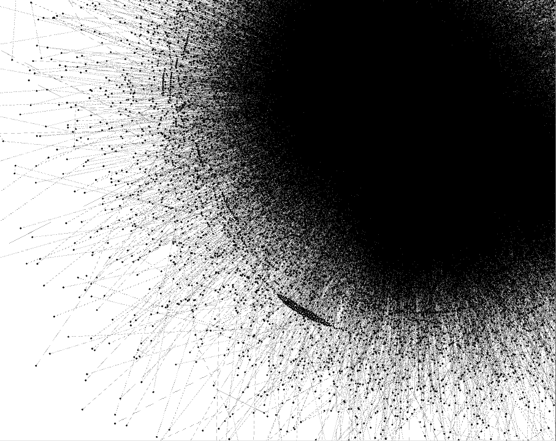

Image above created with [Gephi](https://gephi.org/) based on [GitHub Social Network Dataset](https://snap.stanford.edu/data/github-social.html)

## Outline
* Introduction
* Software
* Algorithm Types
* What is Social Network Analysis?
* Zachary's Karate Club Network
* Network Statistics
* Zachary's Karate Club Network: Community Detection
* GitHub Social Network: Visualization & Community Detection
* References

## Introduction
### What is Social Network Analysis?
> Wikipedia:
[Social network analysis (SNA) is the process of investigating social structures through the use of networks and graph theory](https://en.wikipedia.org/wiki/Social_network_analysis)

## Software
### networkx
* python package
* open source
* 40 algorithms for graph analisys
* 10 millions vertices / 100 millions edges

### neo4j
* graph database (with Python API)
* open source (community / enterprise)
* python API
* 15 algorithms for graph analisys
* 36 billions vertices (community)

### Apache Giraph
* Hadoop based Framework
* open source
* python API
* Used for processing of trillion edges by Facebook (200 machines / 4 min)

## Algorithm Types
* Pathfinding: finds the shortest path / evaluates route availibility and quality
* Centrality: detemines the importance of distinct nodes in the network
* Community Detection: evaluates how group is clustered or partitioned

### Pathfinding
* All Pairs Shortest Path: Figure out traffic load capacity and plan distribution or logistics in an urban area
* Minimum Weight Spanning Tree: Create a low-cost tour of a travel destination

### Centrality
* PageRank: Identify the most influential machine learning features
* Weighted Degree Centrality: Separate fraudsters from the legitimate users
* Betweenness Centrality: Identify the bridge points that connect separate groups
* Closeness Centrality: Determine the delivery ETA for a package

### Community Detection
* Union Find: Find potential duplicate records
* Label Propagation: Figure out dangerous interactions between precription drugs
* Louvain Modularity: Research structures in the brain

## Zachary's Karate Club Network
>The Iris dataset of social network analysis
* A conflict arose which led to the split of the club into two
* Wayne W. Zachary assigned correctly all but one member of the club to the groups they actually joined after the split.
* 34 members of a karate club
* 78 pairwise links between members who interacted outside the club

```python
import networkx as nx
import matplotlib.pyplot as plt
import pandas as pd
import scipy

G = nx.karate_club_graph()
layout = nx.spring_layout(G)
nx.draw(G, layout, with_labels=True)
# A conflict arose between Mr Hi and Officer
# Mr Hi has label 0
nx.draw_networkx_nodes(G, layout, nodelist=[0], node_color='g', alpha=1)
# Officer has label 33
nx.draw_networkx_nodes(G, layout, nodelist=[33], node_color='r', alpha=1)
```
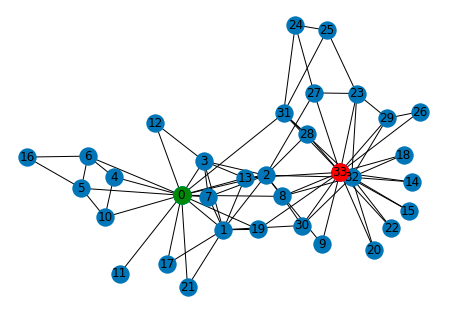


```python
# Replace spring_layout to circular_layout
layout = nx.circular_layout(G)
```
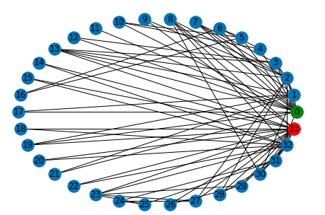


## Network Statistics
### Density
* how complete the graph is (number of edges in the network as compared to the total possible number of edges)

```python
density = nx.density(G)
print('Edge density: ', density)
# Edge density:  0.13903743315508021
```

### Degree
* how many edges each node has (how 'imporant' each node is in the network)
* a common centrality measure
* Nodes with a high centrality might be expected to play important roles in network

```python
degree_view = G.degree()  # (node, degree) pairs
degrees = []  # will need later on for Node Degree Histogram

for (node, degree) in degree_view:
    print(f'Node: {node}, Degree: {degree}')
    degrees.append(degree)

# Node: 0, Degree: 16
# Node: 1, Degree: 9
# Node: 2, Degree: 10
# Node: 3, Degree: 6
# Node: 4, Degree: 3
# ...
# Node: 30, Degree: 4
# Node: 31, Degree: 6
# Node: 32, Degree: 12
# Node: 33, Degree: 17

avg_degree = sum(degrees) / len(degrees)
print('Average Degree: ', avg_degree)
# Average Degree:  4.588235294117647

# The majority of members of the club do not have very many links 
# A few nodes have a lot of links.
plt.hist(degrees, label='Degree Distribution')
plt.axvline(avg_degree, color='r', linestyle='dashed', label='Average Degree')
plt.legend()
plt.ylabel('Number of Nodes')
plt.title('Karate Club: Node Degree')
```
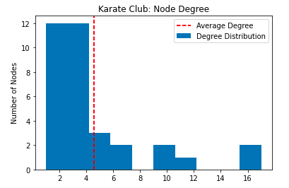


### Local clustering coefficient
* Average probability that a pair of node i’s friends are also friends with each other

```python
local_clustering_coefficient = nx.algorithms.cluster.clustering(G)
avg_local_clustering_coefficient = sum(local_clustering_coefficient.values()) / len(local_clustering_coefficient)

plt.hist(local_clustering_coefficient.values(), label='Local Clustering Coefficient Distribution')
plt.axvline(avg_local_clustering_coefficient, color='r', linestyle='dashed', label='Average Local Clustering Coefficient')
plt.legend()
plt.ylabel('Number of Nodes')
plt.title('Local Clustering Coefficient')
plt.show()
```
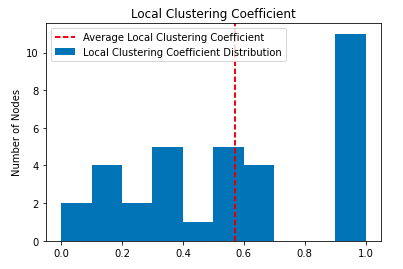

## Zachary's Karate Club Network: Community Detection
```python
labels = {k: f'{k}: {v}' for k, v in nx.get_node_attributes(G, 'club').items()}

# Data has labels already
# we know the answer who will follow Mr. Hi and Officer

# {0: Text(0.27738591528262185, 0.3280225990494209, '0: Mr. Hi',
#  1: Text(0.11465804560002432, 0.21743427165695547, '1: Mr. Hi'),
#  2: Text(-0.003147428460513154, -0.01757526154949603, '2: Mr. Hi'),
#  3: Text(0.34588299722560567, 0.09545926720790861, '3: Mr. Hi'),
#  ...
#  30: Text(-0.03682773871634199, -0.20408817724410044, '30: Officer'),
#  31: Text(-0.2744859725805917, 0.03353304333645198, '31: Officer'),
#  32: Text(-0.24788681234847873, -0.3924916873768424, '32: Officer'),
#  33: Text(-0.23928173574319928, -0.3277003595345542, '33: Officer')}


# But let's try to find out that using community detection algorithms (which works based on network statistics information, and dosn't know about labels)
```

### Bipartitions. Partition a graph into two blocks using the Kernighan–Lin algorithm
```python
communities = nx.algorithms.community.kernighan_lin_bisection(G, partition=None, max_iter=10, weight='weight', seed=None)
print(communities)
# ({32, 33, 8, 14, 15, 18, 20, 22, 23, 24, 25, 26, 27, 28, 29, 30, 31}, {0, 1, 2, 3, 4, 5, 6, 7, 9, 10, 11, 12, 13, 16, 17, 19, 21})
# As we can see, Mr Hi (0) and Officer (33) are in different communities

layout = nx.spring_layout(G)
nx.draw_networkx_nodes(G, layout, nodelist=sorted(communities[0]), node_color='g', alpha=0.5)
nx.draw_networkx_nodes(G, layout, nodelist=sorted(communities[1]), node_color='r', alpha=0.5)
nx.draw_networkx_edges(G, layout, width = 0.2)
nx.draw_networkx_labels(G, layout, labels, font_size=9)
```
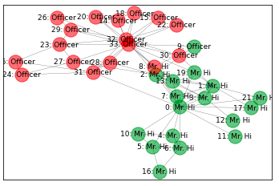

### Modularity-based communities. Find communities in graph using Clauset-Newman-Moore greedy modularity maximization.
```python
communities = list(nx.algorithms.community.modularity_max.greedy_modularity_communities(G))  
print(communities)
# found 3 communities
# [frozenset({32, 33, 8, 14, 15, 18, 20, 22, 23, 24, 25, 26, 27, 28, 29, 30, 31}), frozenset({1, 2, 3, 7, 9, 12, 13, 17, 21}), frozenset({0, 4, 5, 6, 10, 11, 16, 19})]
nx.draw_networkx_nodes(G, layout, nodelist=sorted(communities[0]), node_color='g', alpha=0.5)
nx.draw_networkx_nodes(G, layout, nodelist=sorted(communities[1]), node_color='r', alpha=0.5)
nx.draw_networkx_nodes(G, layout, nodelist=sorted(communities[2]), node_color='b', alpha=0.5)
nx.draw_networkx_edges(G, layout, width = 0.2)
nx.draw_networkx_labels(G, layout, labels, font_size=9)
```
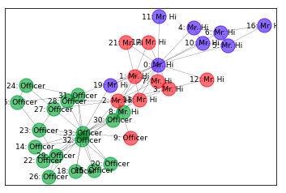

```python
# community 1 and 2 can be combined
combined_community = sorted(communities[1]) + sorted(communities[2])
nx.draw_networkx_nodes(G, layout, nodelist=communities[0], node_color='g', alpha=0.5)
nx.draw_networkx_nodes(G, layout, nodelist=combined_community, node_color='m', alpha=0.5)
nx.draw_networkx_edges(G, layout, style='dashed', width = 0.5)
nx.draw_networkx_labels(G, layout, club_labels, font_size=9)
plt.show()
```
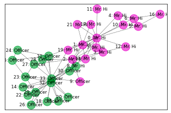


### Label propagation community detection algorithms
```python
# algorithm returns generator
communities = list(nx.algorithms.community.label_propagation_communities(G))
print(communities)
# [{32, 33, 2, 8, 9, 14, 15, 18, 20, 22, 23, 26, 27, 28, 29, 30}, {16, 5, 6}, {0, 1, 3, 4, 7, 10, 11, 12, 13, 17, 19, 21, 24, 25, 31}]
nx.draw_networkx_nodes(G, layout, nodelist=sorted(communities[0]), node_color='g', alpha=0.5)
nx.draw_networkx_nodes(G, layout, nodelist=sorted(communities[1]), node_color='r', alpha=0.5)
nx.draw_networkx_nodes(G, layout, nodelist=sorted(communities[2]), node_color='b', alpha=0.5)
nx.draw_networkx_edges(G, layout, width = 0.2)
nx.draw_networkx_labels(G, layout, labels, font_size=9)
```
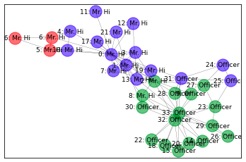


## GitHub Social Network: Visualization & Community Detection

[GitHub Social Network Dataset](https://snap.stanford.edu/data/github-social.html)

>A large social network of GitHub developers which was collected from the public API in June 2019. Nodes are developers who have starred at least 10 repositories and edges are mutual follower relationships between them. The vertex features are extracted based on the location, repositories starred, employer and e-mail address. The task related to the graph is binary node classification - one has to predict whether the GitHub user is a web or a machine learning developer. This target feature was derived from the job title of each user.

Properties

- Directed: No.
- Node features: Yes.
- Edge features: No.
- Node labels: Yes. Binary-labeled.
- Temporal: No.
- Nodes: 37,700
- Edges: 289,003
- Density: 0.001 
- Transitvity: 0.013

Possible Tasks

- Binary node classification
- Link prediction
- Community detection
- Network visualization


### Network visualization

#### Tools:
* [Gephi](https://gephi.org/)

##### Initial Visualisation


##### Yifan Hu Layout with Gephi
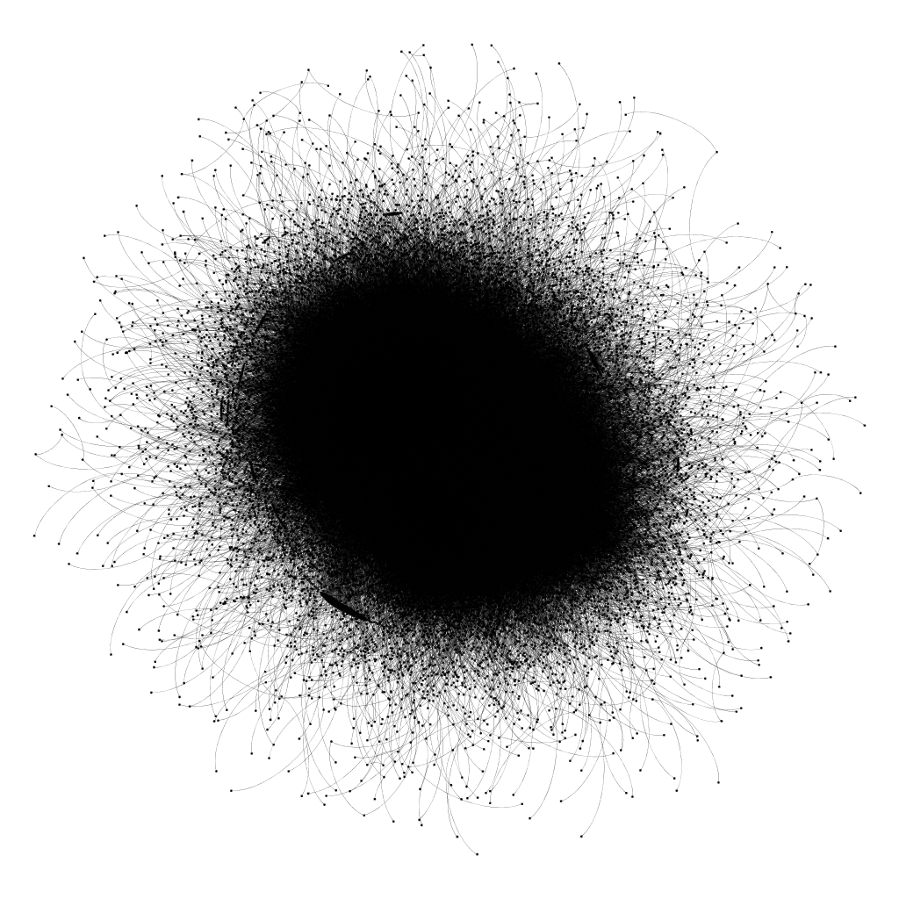


### Community Detection
```python
# Download GitHub Social Network Dataset (https://snap.stanford.edu/data/github-social.html)

target_df = pd.read_csv('GitHub Social Network Dataset/git_web_ml/musae_git_target.csv')
[289003 rows x 2 columns]

          id            name  ml_target
0          0          Eiryyy          0
1          1      shawflying          0
2          2     JpMCarrilho          1
3          3       SuhwanCha          0
4          4    sunilangadi2          1
...      ...             ...        ...
37695  37695  shawnwanderson          1
37696  37696       kris-ipeh          0
37697  37697        qpautrat          0
37698  37698        Injabie3          1
37699  37699   caseycavanagh          0

[37700 rows x 3 columns]

df = pd.read_csv('GitHub Social Network Dataset/git_web_ml/musae_git_edges.csv')
G = nx.from_pandas_edgelist(df, 'id_1', 'id_2')

         id_1   id_2
0           0  23977
1           1  34526
2           1   2370
3           1  14683
4           1  29982
...       ...    ...
288998  37527  37596
288999  37529  37601
289000  37644   2347
289001  25879   2347
289002  25616   2347

# 1. bisection
kernighan_lin_bisection_communities = nx.algorithms.community.kernighan_lin_bisection(G, partition=None, max_iter=10, weight='weight', seed=None)
# KL partiotions: 18850 nodes each

# 2. modularity
greedy_modularity_communities = nx.algorithms.community.greedy_modularity_communities(G)
# greedy_modularity_communities: 395

# 3. label propagation
label_propagation_communities = list(nx.algorithms.community.label_propagation_communities(G))
# label_propagation_communities: 348

          id  greedy_modularity_community          name  ml_target  \
0          0                            0        Eiryyy          0   
1      32769                            0       ameesme          0   
2          2                            0   JpMCarrilho          1   
3          5                            0     j6montoya          0   
4          6                            0         sfate          0   
...      ...                          ...           ...        ...   
37695  36351                          392     razondpro          0   
37696  32312                          393     andres99x          0   
37697  30677                          393       bilby91          0   
37698  37554                          394  DaviSpindola          0   
37699  34066                          394        korokd          0   

       kernighan_lin_bisection_community  label_propagation_community  
0                                      1                           88  
1                                      0                           88  
2                                      1                           88  
3                                      1                           88  
4                                      0                           88  
...                                  ...                          ...  
37695                                  0                           94  
37696                                  0                           88  
37697                                  0                           88  
37698                                  0                          132  
37699                                  1                          132  

[37700 rows x 6 columns]
```

##### kernighan_lin_bisection
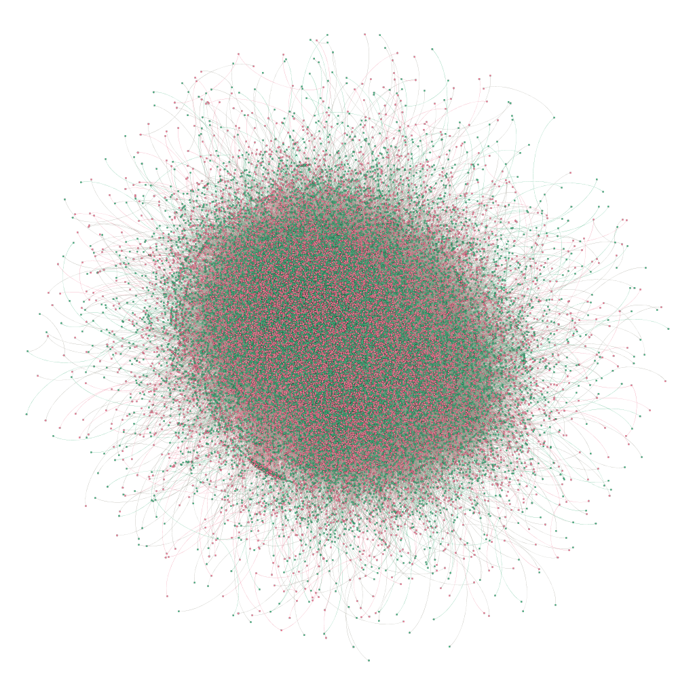


##### label_propagation_communities
* 97,88% of nodes are in the same community
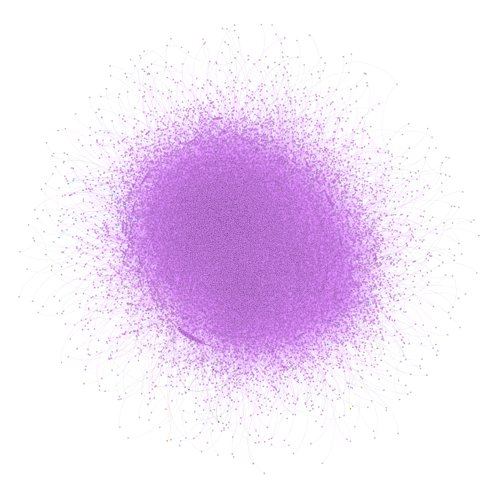

##### greedy_modularity_communities
* 0 - 34,52%
* 1 - 30,1%
* 2 - 24,44%
* 3 - 4,44%
* 4 - 0,94%
* 5 - 0,68%
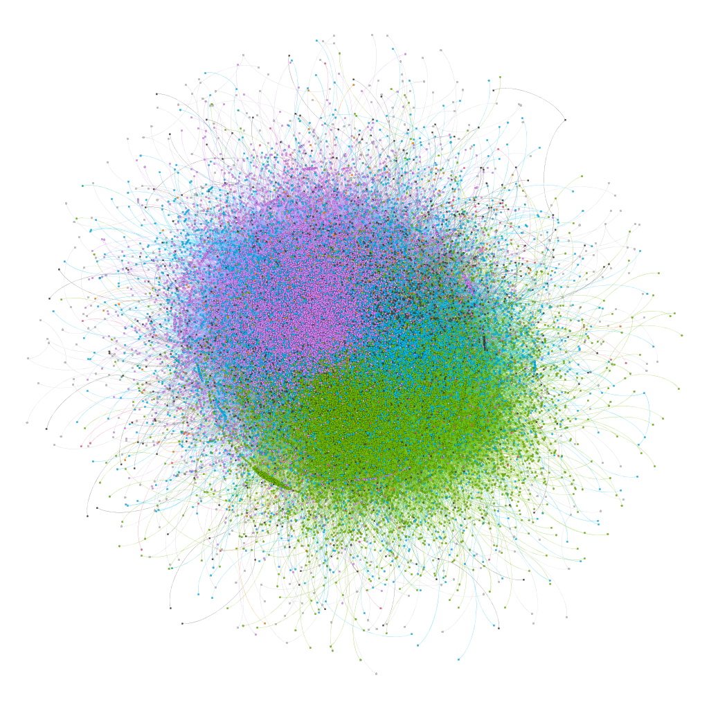


>Whether the GitHub user is a web or a machine learning developer

* 74,17% web developers
* 25,83% machine learning developers

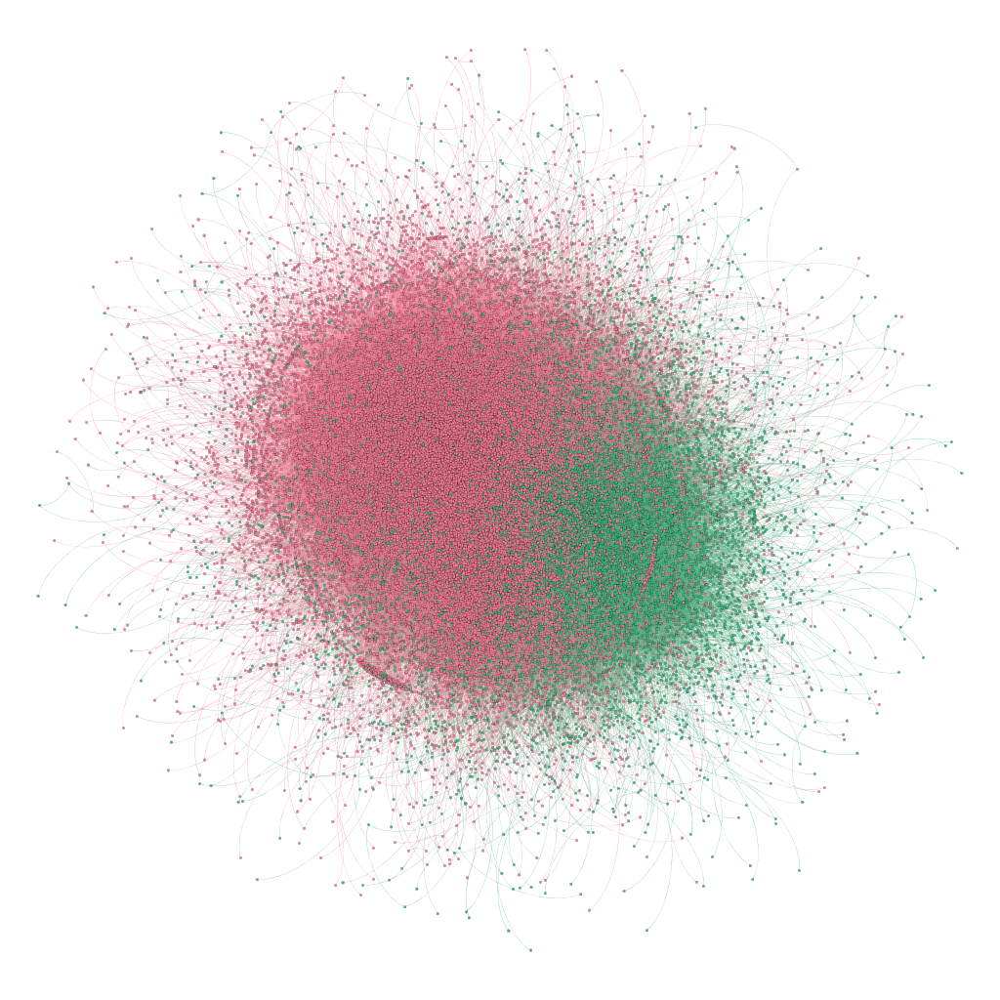


## References

### Datasets
* [Stanford Large Network Dataset Collection](https://snap.stanford.edu/data/#amazon)

### Packages
* [NetworkX: Network Analysis in Python](https://networkx.github.io/)

### Videos
* [Rob Chew, Peter Baumgartner | Connected: A Social Network Analysis Tutorial with NetworkX](https://youtu.be/7fsreJMy_pI)
[Repository Link](https://github.com/rtidatascience/connected-nx-tutorial)

* [Introduction to SNA](https://youtu.be/wwam5UZO7os)

### Books
* [Networks, Crowds, and Markets:Reasoning About a Highly Connected World](http://www.cs.cornell.edu/home/kleinber/networks-book/)

### Browser Games
* [The Wisdom and Madness of Crowds](https://ncase.me/crowds/)
